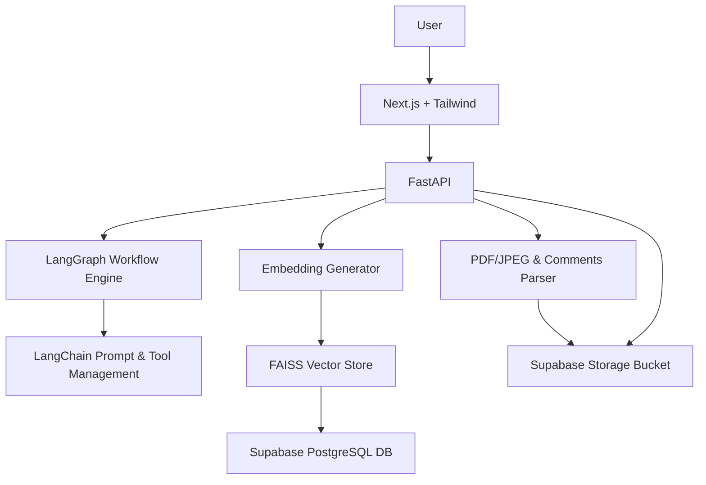

# Product Requirements Document (PRD)

## Project Overview

### Title:

Social Media Analytics Chat Agent

### Objective:

Develop a friendly and efficient chat-based agent that helps users analyze data-heavy reports (charts and user comments) to extract insights on social media activity related to a media brand.

## Key Features:

### Chat Interface

* User-friendly, conversational UX
* Focuses interactions strictly around analytical queries

### Data Handling

* Accepts user input:

  * Charts (PDF or optionally JPEG)
  * User comments (plain text)
* Extract and preprocess data into structured context

### Analysis Capabilities

* Identifies analytical vs non-analytical queries
* Extracts insights relevant to user queries
* Contextually selects subsets of charts/comments for effective analysis
* Clearly communicates results and asks clarifying or follow-up questions when needed

## Technical Stack

### Frontend:

* **Next.js**: Provides a reactive, performant, and SEO-friendly frontend.
* Tailwind CSS: For quick, clean, responsive styling.
* Axios: HTTP requests to backend.

### Backend:

* **LangGraph + LangChain**: Efficient orchestration for conversation flows and interactions with LLMs.
* FastAPI: API endpoints serving frontend requests.
* PDF parsing via PyMuPDF or pdfplumber.
* Embeddings/Search: FAISS for efficient vector search.
* Supabase for PostgreSQL database and file storage (Supabase Storage Bucket).

### AI Model:

* GPT-3.5 Turbo for cost-effective yet capable analysis (upgradeable to GPT-4 for enhanced accuracy).

## System Architecture

* Frontend served by Next.js (hosted on Vercel).
* Backend API built with FastAPI.
* LangGraph manages agent flow; LangChain handles prompt templating and tool management.
* Data storage for context managed via FAISS and Supabase.

### Mermaid Architecture Diagram

## Workflow:

1. User submits query along with charts/comments.
2. Backend validates query type:

   * Non-analytic: Redirect politely to analytic queries.
   * Analytic: Proceed to data extraction and context creation.
3. Context narrowed via subset selection tools.
4. LangGraph orchestrates planning and execution of analysis via LangChain tools and LLM.
5. Response validation:

   * Clarify if insufficient context.
   * Provide insights and prompt user for further questions.

## Implementation Steps / Tasks:

* Parse and preprocess user comments from plain text.
* Parse and extract numerical data from PDF or image charts.
* Generate embeddings for comments and chart data.
* Store embeddings in FAISS vector store.
* Implement analytical query validation and categorization.
* Create subset selection tools for context narrowing.
* Develop LangGraph workflow for orchestration.
* Integrate LangChain for prompt templating and tool management.
* Implement response validation logic.
* Develop frontend chat interface using Next.js and Tailwind CSS.
* Connect frontend and backend via Axios and FastAPI endpoints.

## Scaling Strategy:

* Parallelize queries via distributed LangGraph deployments.
* Incremental indexing for large comment sets.
* Load balancer (e.g., NGINX) to manage 500+ concurrent users.

## Cloud Deployment Considerations:

* Backend deployment using container services (e.g., AWS ECS, Supabase-managed services).
* Supabase Storage for scalable storage of uploaded assets.
* Supabase PostgreSQL database for managed database.
* ElasticCache (Redis) for state management and session persistence.
* CDN (AWS CloudFront) for latency optimization.
* Queues (AWS SQS/Celery) to handle asynchronous tasks.

## Grounding and Hallucination Mitigation:

* Implement strict RAG (Retrieval-Augmented Generation) architecture.
* FAISS vector store to ground model responses.
* Prompt engineering with detailed instructions to minimize hallucination.
* Post-processing validation checks for responses.
